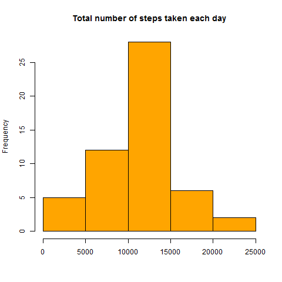
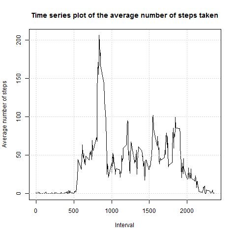

## Loading data.

This code downloads dataset and required packages:

```r
library(dplyr)
library(lattice)

# Reading data
url <- "https://d396qusza40orc.cloudfront.net/repdata%2Fdata%2Factivity.zip"
download.file(url, "data.zip")
data <- read.csv("activity.csv")
```

## Creating histogram of the total number of steps taken each day.

Firstly we should prepare the data. The **NA** values should be removed, after that data should be grouped by each day and total number of steps taken each day should be calculated.

The following code does id:

```r
# Removing NA - values
data <- data[!is.na(data$steps), ]
# Grouping data by date, adding sum and mean of steps for each date
grouped.by.date <- group_by(data, date)
grouped.by.date <- mutate(grouped.by.date, summ = sum(steps))
grouped.by.date <- mutate(grouped.by.date, mean = mean(steps))
grouped.by.date <- unique(select(grouped.by.date, date, summ, mean))
```
After preparing data it is become possible to create histogram of the total number of steps taken each day. 

This code creates the histogram:

```r
# Plotting histogram of total number of steps taken each day
png(filename = "figure/hist1.png")
hist(grouped.by.date$summ, 
     main = "Total number of steps taken each day", 
     xlab = "", 
     col = "orange")
dev.off()
```




## Mean and median number of steps taken each day.

Mean and median number of steps taken each day are calculated by the following code:

```r
# Calulating mean and median number of steps taken each day
mean.steps <- mean(grouped.by.date$summ)
median.steps <- median(grouped.by.date$summ)
```

In fact, **mean** and **median** are equal: **10766.19**.


## Time series plot of the average number of steps taken.

This code groups data by intervals, caclulates for each interval average number of steps taken:

```r
# Grouping data by interval, adding mean of steps for each interval
timeSeries <- group_by(data, interval)
timeSeries <- mutate(timeSeries, mean_ts = mean(steps))
timeSeries <- unique(select(timeSeries, interval, mean_ts))
```

This code creates the plot:

```r
# Plotting time series plot of the average number of steps taken
png(filename = "figure/plot1.png")
plot(timeSeries$interval, 
     timeSeries$mean_ts, 
     type = 'l',
     main = "Time series plot of the average number of steps taken",
     xlab = "Interval",
     ylab = "Average number of steps")
grid()
dev.off()
```



This code find 5-minute interval that, on average, contains the maximum number of steps:

```r
# Searching the 5-minute interval that, on average, contains the maximum number of steps
timeSeries[timeSeries$mean_ts == max(timeSeries$mean_ts), ]
```

This 5-minute interval is equal to **835**.

## Imputing missing values.

**NA** values of steps will be replaced with it average number per corresponding interval. For example, value of step for each row where **interval = 5** and **step = NA** will be replaced with average number of steps per all rows, where **interval = 5**.

The following code does id:

```r
# Reading data with NA values
data <- read.csv("activity.csv")

# Contrilling if there are NA data
table(is.na(data$steps))
table(is.na(data$date))
table(is.na(data$interval))

# Grouping by intervals
data <- group_by(data, interval)
# Calculating average number per each interval
data <- mutate(data, mean = mean(steps, na.rm = TRUE))
# Replacing NA step values with average number per corresponding interval 
data$steps <- ifelse(is.na(data$steps), data$mean, data$steps)
```

As it could be seen, there are **2304** rows with **step = NA**. Other variables don't have values **NA**.

After that, the following code creates new histogram of the total number of steps taken each day, using data with imputed missing values (instead removing it).


```r
# Grouping data by date, adding sum and mean of steps for each date
grouped.by.date <- group_by(data, date)
grouped.by.date <- mutate(grouped.by.date, summ = sum(steps, na.rm = TRUE))
grouped.by.date <- unique(select(grouped.by.date, date, summ))

# Plotting histogram of total number of steps taken each day
png(filename = "hist2.png")
hist(grouped.by.date$summ, 
     main = "Total number of steps taken each day after missing values are imputed", 
     xlab = "", 
     col = "green")
dev.off()
```


It can be seen that histogram of the total number of steps taken each day in this case has the same shape then the same histogram with removed **NA**'s. The difference is that now hisogram is higher in it center.

Mean and median number of steps taken each day are calculated by the following code:

```r
# Calulating mean and median number of steps taken each day
mean.steps.na <- mean(grouped.by.date$summ)
median.steps.na <- median(grouped.by.date$summ)
```

New **mean.na** and **median.na** are equal between each other and equal to "old" **mean** and **median** from data without **NA**'s: **10766.19**. 

## Are there differences in activity patterns between weekdays and weekends?

To find the answer to this question we will make a panel plot containing a time series plot of the 5-minute interval (x-axis) and the average number of steps taken, averaged across all weekday days or weekend days (y-axis).

This code adds data about days of weeks: is day a weekday, or weekend.

```r
# Adding data about weekdays
Sys.setlocale("LC_TIME","English")
# Adding name of the day
data$weekday <- weekdays(as.Date(data$date))
# Adding type of the day (weekday or weekend)
data$type <- as.factor(ifelse(data$weekday == 'Saturday' | data$weekday == 'Sunday', "Weekend", "Weekday"))
# Grouping data
timeSeries <- group_by(data, interval, type)
timeSeries <- mutate(timeSeries, mean_ts = mean(steps, na.rm = TRUE))
timeSeries <- unique(select(timeSeries, type, interval, mean_ts))
```

Now it is possible to create a panel plot containing a time series plot of the 5-minute interval (x-axis) and the average number of steps taken, averaged across all weekday days or weekend days (y-axis).

This code creates the plot:

```r
# Plot comparing the average number of steps taken per 5-minute interval across weekdays and weekends
png(filename = "figure/plot2.png")
xyplot(mean_ts ~ interval | type, data = timeSeries, layout = c(1, 2), type = 'l', 
       xlab = "Interval",
       ylab = "Average number of steps")
dev.off()
```

